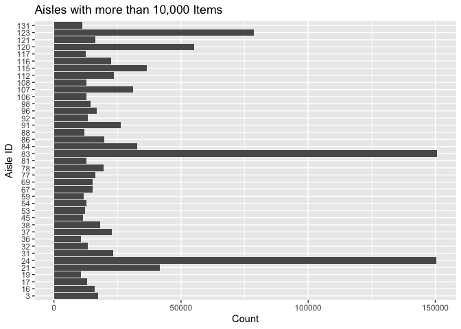
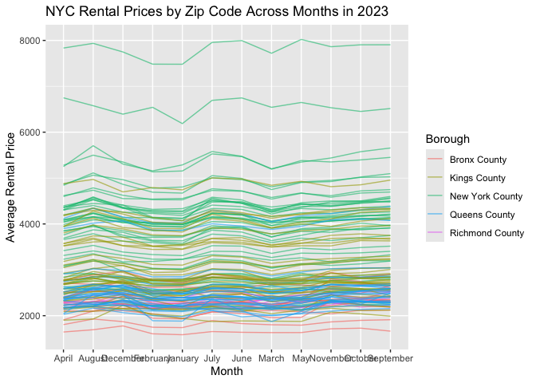

p8105_hw3_nrl2142
================
2025-10-04

``` r
library(tidyverse)
```

    ## ── Attaching core tidyverse packages ──────────────────────── tidyverse 2.0.0 ──
    ## ✔ dplyr     1.1.4     ✔ readr     2.1.5
    ## ✔ forcats   1.0.0     ✔ stringr   1.5.1
    ## ✔ ggplot2   4.0.0     ✔ tibble    3.3.0
    ## ✔ lubridate 1.9.4     ✔ tidyr     1.3.1
    ## ✔ purrr     1.1.0     
    ## ── Conflicts ────────────────────────────────────────── tidyverse_conflicts() ──
    ## ✖ dplyr::filter() masks stats::filter()
    ## ✖ dplyr::lag()    masks stats::lag()
    ## ℹ Use the conflicted package (<http://conflicted.r-lib.org/>) to force all conflicts to become errors

``` r
library (ggridges)
library(patchwork)
library(p8105.datasets)
```

## Problem 1

``` r
data("instacart")
instacart
```

    ## # A tibble: 1,384,617 × 15
    ##    order_id product_id add_to_cart_order reordered user_id eval_set order_number
    ##       <int>      <int>             <int>     <int>   <int> <chr>           <int>
    ##  1        1      49302                 1         1  112108 train               4
    ##  2        1      11109                 2         1  112108 train               4
    ##  3        1      10246                 3         0  112108 train               4
    ##  4        1      49683                 4         0  112108 train               4
    ##  5        1      43633                 5         1  112108 train               4
    ##  6        1      13176                 6         0  112108 train               4
    ##  7        1      47209                 7         0  112108 train               4
    ##  8        1      22035                 8         1  112108 train               4
    ##  9       36      39612                 1         0   79431 train              23
    ## 10       36      19660                 2         1   79431 train              23
    ## # ℹ 1,384,607 more rows
    ## # ℹ 8 more variables: order_dow <int>, order_hour_of_day <int>,
    ## #   days_since_prior_order <int>, product_name <chr>, aisle_id <int>,
    ## #   department_id <int>, aisle <chr>, department <chr>

``` r
instacart|>
  count(aisle_id, sort = TRUE)
```

    ## # A tibble: 134 × 2
    ##    aisle_id      n
    ##       <int>  <int>
    ##  1       83 150609
    ##  2       24 150473
    ##  3      123  78493
    ##  4      120  55240
    ##  5       21  41699
    ##  6      115  36617
    ##  7       84  32644
    ##  8      107  31269
    ##  9       91  26240
    ## 10      112  23635
    ## # ℹ 124 more rows

There are 134 number of aisles in the instacart dataset. The aisles with
the most items ordered from are aisles 83, 24, 123, 120, 21, 115, 84,
107, 91 and 112.

Making a plot

``` r
morethantenk_df =
instacart |>
  select(aisle_id)|>
  count(aisle_id, name = "n" ) |>
  filter (n>10000)|>
  arrange(desc(n))

morethantenk_df
```

    ## # A tibble: 39 × 2
    ##    aisle_id      n
    ##       <int>  <int>
    ##  1       83 150609
    ##  2       24 150473
    ##  3      123  78493
    ##  4      120  55240
    ##  5       21  41699
    ##  6      115  36617
    ##  7       84  32644
    ##  8      107  31269
    ##  9       91  26240
    ## 10      112  23635
    ## # ℹ 29 more rows

``` r
ggplot(morethantenk_df, aes(x=n, y=factor(aisle_id))) +
  geom_col() +
  labs (x = "Count", 
        y = "Aisle ID",
        title = "Aisles with more than 10,000 Items")
```

<!-- -->

Making a table

``` r
targetaisles_df =
  instacart |>
  select (aisle, product_name)|>
  filter(aisle == c("baking ingredients", "dog food care", "packaged vegetables fruits")) |>
   group_by(product_name, aisle) |>
  summarise(item_count =n ())|>
  arrange (aisle, desc(item_count)) |>
  group_by(aisle) |>
  slice_max(product_name, n=3) |>
  drop_na() 
```

    ## `summarise()` has grouped output by 'product_name'. You can override using the
    ## `.groups` argument.

``` r
targetaisles_df
```

    ## # A tibble: 9 × 3
    ## # Groups:   aisle [3]
    ##   product_name                                     aisle              item_count
    ##   <chr>                                            <chr>                   <int>
    ## 1 Zero Calorie Sweetener                           baking ingredients         31
    ## 2 Zero Calorie  Sweetener Packets 50 Count         baking ingredients          1
    ## 3 Yellow Enriched & Degerminated Corn Meal         baking ingredients          1
    ## 4 smart Blend Chicken & Rice Formula Dry Dog Food  dog food care               1
    ## 5 Zero Grain Turkey Dog Food                       dog food care               1
    ## 6 With Chicken & Veal in Meaty Juices Wet Dog Food dog food care               2
    ## 7 Zucchini Squash, Baby Courgette                  packaged vegetabl…          3
    ## 8 Zucchini Noodles                                 packaged vegetabl…         60
    ## 9 Yukon Gold Potato                                packaged vegetabl…         22

Making the 2x7 table

``` r
orderhour_df <- instacart |>
  select(product_name, order_hour_of_day, order_dow) |>
  filter(product_name == c("Pink Lady Apples", "Coffee Ice Cream")) |>
  group_by(product_name, order_dow) |>
  summarise(mean_value = mean(order_hour_of_day, na.rm = TRUE), .groups = "drop") |>
  mutate(order_dow = recode(as.character(order_dow),
                            `0` = "Sunday",
                            `1` = "Monday",
                            `2` = "Tuesday",
                            `3` = "Wednesday",
                            `4` = "Thursday",
                            `5` = "Friday",
                            `6` = "Saturday")) |>
  pivot_wider(
    names_from = order_dow,
    values_from = mean_value
  )
```

    ## Warning: There was 1 warning in `filter()`.
    ## ℹ In argument: `product_name == c("Pink Lady Apples", "Coffee Ice Cream")`.
    ## Caused by warning in `product_name == c("Pink Lady Apples", "Coffee Ice Cream")`:
    ## ! longer object length is not a multiple of shorter object length

``` r
orderhour_df
```

    ## # A tibble: 2 × 8
    ##   product_name     Sunday Monday Tuesday Wednesday Thursday Friday Saturday
    ##   <chr>             <dbl>  <dbl>   <dbl>     <dbl>    <dbl>  <dbl>    <dbl>
    ## 1 Coffee Ice Cream   13.2   15      15.3      15.4     15.2   10.3     12.4
    ## 2 Pink Lady Apples   12.2   11.7    12        13.9     11.9   13.9     11.6

## Problem 2

``` r
zorizipcount_df =
  zorizipcount_df = read_csv ("/Users/gorgeous/p8105_hw2_nrl2142/hw2_data/zillow_data/Zip_zori_uc_sfrcondomfr_sm_month_NYC.csv",na = c("NA", ".","")) |>
  janitor::clean_names() |>
   pivot_longer (
  cols = x2015_01_31:x2024_08_31,
    names_to = "date",
    values_to ="zori",
    names_prefix ="x") |>
  count(region_name) |>
  summarise(
    zip_116 = sum (n==116),
zip_under_10 = sum(n <10))
```

    ## Rows: 149 Columns: 125
    ## ── Column specification ────────────────────────────────────────────────────────
    ## Delimiter: ","
    ## chr   (6): RegionType, StateName, State, City, Metro, CountyName
    ## dbl (119): RegionID, SizeRank, RegionName, 2015-01-31, 2015-02-28, 2015-03-3...
    ## 
    ## ℹ Use `spec()` to retrieve the full column specification for this data.
    ## ℹ Specify the column types or set `show_col_types = FALSE` to quiet this message.

``` r
zorizipcount_df
```

    ## # A tibble: 1 × 2
    ##   zip_116 zip_under_10
    ##     <int>        <int>
    ## 1     149            0

## Short description (double check if I really don’t have any zipcodes less than 10)

``` r
zorirental_df=
 zorirental_df = read_csv ("/Users/gorgeous/p8105_hw2_nrl2142/hw2_data/zillow_data/Zip_zori_uc_sfrcondomfr_sm_month_NYC.csv",na = c("NA", ".","")) |>
  janitor::clean_names() |>
   pivot_longer (
  cols = x2015_01_31:x2024_08_31,
    names_to = "date",
    values_to ="zori",
    names_prefix ="x") |>
  separate(date, into = c("year", "month", "day"), sep = "_") |>
  mutate (year = as.integer(year),
          month = month.name [as.numeric (month)]) |>
  drop_na(zori)|>
  select(zori,county_name,year)|>
  group_by(county_name, year) |>
  summarise(mean_value = mean(zori), na.rm = TRUE)
```

    ## Rows: 149 Columns: 125
    ## ── Column specification ────────────────────────────────────────────────────────
    ## Delimiter: ","
    ## chr   (6): RegionType, StateName, State, City, Metro, CountyName
    ## dbl (119): RegionID, SizeRank, RegionName, 2015-01-31, 2015-02-28, 2015-03-3...
    ## 
    ## ℹ Use `spec()` to retrieve the full column specification for this data.
    ## ℹ Specify the column types or set `show_col_types = FALSE` to quiet this message.
    ## `summarise()` has grouped output by 'county_name'. You can override using the `.groups` argument.

``` r
zorirental_df
```

    ## # A tibble: 45 × 4
    ## # Groups:   county_name [5]
    ##    county_name   year mean_value na.rm
    ##    <chr>        <int>      <dbl> <lgl>
    ##  1 Bronx County  2015      1760. TRUE 
    ##  2 Bronx County  2016      1520. TRUE 
    ##  3 Bronx County  2017      1544. TRUE 
    ##  4 Bronx County  2018      1639. TRUE 
    ##  5 Bronx County  2019      1706. TRUE 
    ##  6 Bronx County  2020      1811. TRUE 
    ##  7 Bronx County  2021      1858. TRUE 
    ##  8 Bronx County  2022      2054. TRUE 
    ##  9 Bronx County  2023      2285. TRUE 
    ## 10 Bronx County  2024      2497. TRUE 
    ## # ℹ 35 more rows

## Short descriptive paragraph

Overall, rental prices are increasing across all boroughs in New York
from the years 2015 to 2024. The borough that experienced the steepest
increase in rental prices is Manhatten with a rent increase of 1056.398,
followed by the Bronx with an incrwase of 737.301. This could
potentially be due to reasons such as increasing gentrification,
inflation or the general appeal to bein close proximity to Manhatten due
to the availability of employment opportunities.

Zip code rental plot

``` r
zipcoderental_df = read_csv ("/Users/gorgeous/p8105_hw2_nrl2142/hw2_data/zillow_data/Zip_zori_uc_sfrcondomfr_sm_month_NYC.csv",na = c("NA", ".","")) |>
  janitor::clean_names() |>
   pivot_longer (
  cols = x2015_01_31:x2024_08_31,
    names_to = "date",
    values_to ="zori",
    names_prefix ="x") |>
  separate(date, into = c("year", "month", "day"), sep = "_") |>
  mutate (year = as.integer(year),
          month = month.name [as.numeric (month)]) |>
  filter(year == 2023) |>
  drop_na(zori)|>
  select(zori,year,month,region_name,county_name)|>
  group_by(month,region_name, county_name) |>
  summarise(mean_value = mean(zori), na.rm = TRUE)
```

    ## Rows: 149 Columns: 125
    ## ── Column specification ────────────────────────────────────────────────────────
    ## Delimiter: ","
    ## chr   (6): RegionType, StateName, State, City, Metro, CountyName
    ## dbl (119): RegionID, SizeRank, RegionName, 2015-01-31, 2015-02-28, 2015-03-3...
    ## 
    ## ℹ Use `spec()` to retrieve the full column specification for this data.
    ## ℹ Specify the column types or set `show_col_types = FALSE` to quiet this message.
    ## `summarise()` has grouped output by 'month', 'region_name'. You can override using the `.groups` argument.

``` r
ggplot(zipcoderental_df, (aes(x = month, y = mean_value, group = region_name, color = county_name)))+
         geom_line (alpha = 0.6)+
         labs(
           title = "NYC Rental Prices by Zip Code Across Months in 2023",
           x = "Month",
           y = "Average Rental Price",
           color = "Borough")
```

<!-- -->

``` r
zipcoderental_df
```

    ## # A tibble: 1,455 × 5
    ## # Groups:   month, region_name [1,455]
    ##    month region_name county_name     mean_value na.rm
    ##    <chr>       <dbl> <chr>                <dbl> <lgl>
    ##  1 April       10001 New York County      4842. TRUE 
    ##  2 April       10002 New York County      4193. TRUE 
    ##  3 April       10003 New York County      4306. TRUE 
    ##  4 April       10004 New York County      3843. TRUE 
    ##  5 April       10005 New York County      3941. TRUE 
    ##  6 April       10006 New York County      4373. TRUE 
    ##  7 April       10007 New York County      7834. TRUE 
    ##  8 April       10009 New York County      4041. TRUE 
    ##  9 April       10010 New York County      4355. TRUE 
    ## 10 April       10011 New York County      4867. TRUE 
    ## # ℹ 1,445 more rows
