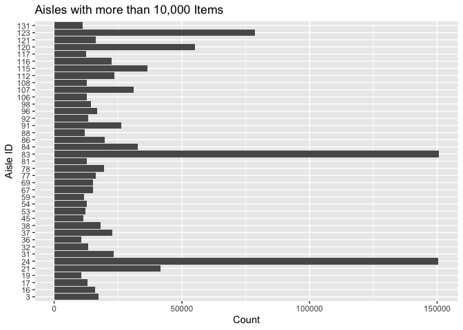
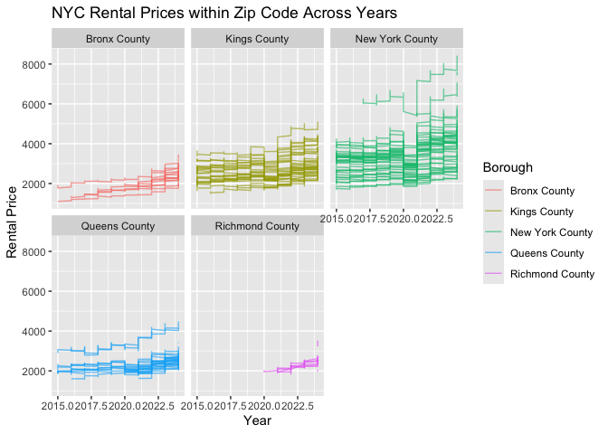
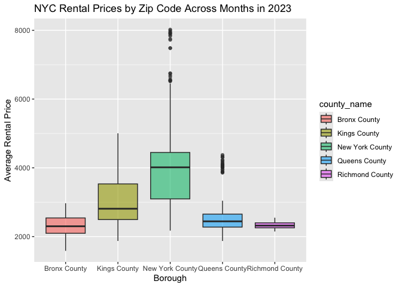
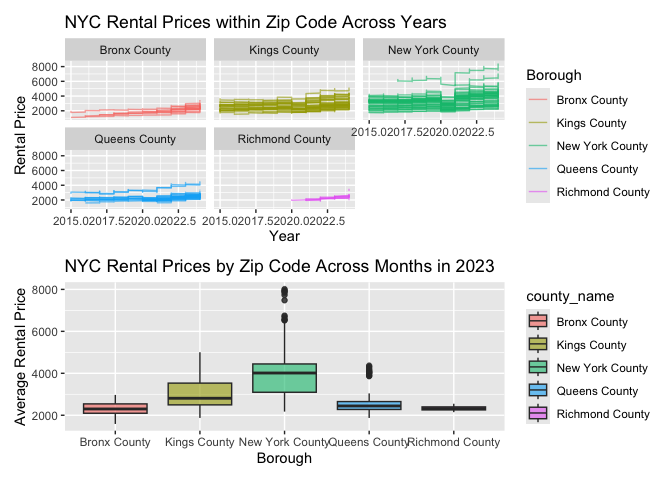
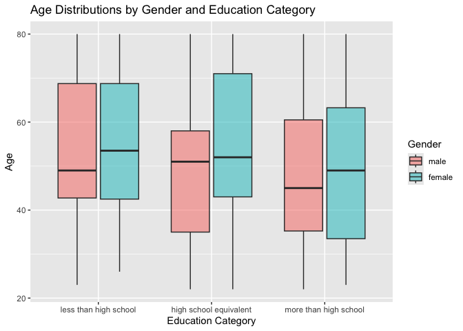
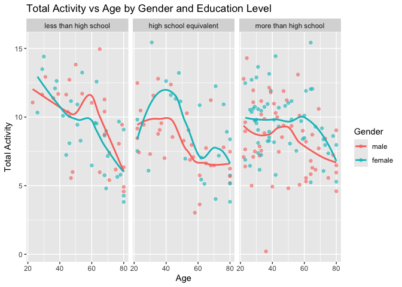
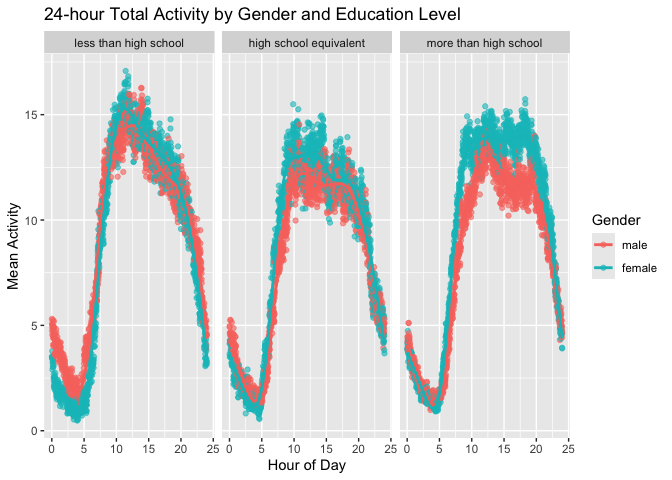

p8105_hw3_nrl2142
================
2025-10-04

``` r
library(tidyverse)
```

    ## ── Attaching core tidyverse packages ──────────────────────── tidyverse 2.0.0 ──
    ## ✔ dplyr     1.1.4     ✔ readr     2.1.5
    ## ✔ forcats   1.0.0     ✔ stringr   1.5.1
    ## ✔ ggplot2   4.0.0     ✔ tibble    3.3.0
    ## ✔ lubridate 1.9.4     ✔ tidyr     1.3.1
    ## ✔ purrr     1.1.0     
    ## ── Conflicts ────────────────────────────────────────── tidyverse_conflicts() ──
    ## ✖ dplyr::filter() masks stats::filter()
    ## ✖ dplyr::lag()    masks stats::lag()
    ## ℹ Use the conflicted package (<http://conflicted.r-lib.org/>) to force all conflicts to become errors

``` r
library (ggridges)
library(patchwork)
library(p8105.datasets)
```

## Problem 1

``` r
data("instacart")
instacart
```

    ## # A tibble: 1,384,617 × 15
    ##    order_id product_id add_to_cart_order reordered user_id eval_set order_number
    ##       <int>      <int>             <int>     <int>   <int> <chr>           <int>
    ##  1        1      49302                 1         1  112108 train               4
    ##  2        1      11109                 2         1  112108 train               4
    ##  3        1      10246                 3         0  112108 train               4
    ##  4        1      49683                 4         0  112108 train               4
    ##  5        1      43633                 5         1  112108 train               4
    ##  6        1      13176                 6         0  112108 train               4
    ##  7        1      47209                 7         0  112108 train               4
    ##  8        1      22035                 8         1  112108 train               4
    ##  9       36      39612                 1         0   79431 train              23
    ## 10       36      19660                 2         1   79431 train              23
    ## # ℹ 1,384,607 more rows
    ## # ℹ 8 more variables: order_dow <int>, order_hour_of_day <int>,
    ## #   days_since_prior_order <int>, product_name <chr>, aisle_id <int>,
    ## #   department_id <int>, aisle <chr>, department <chr>

``` r
instacart|>
  count(aisle_id, sort = TRUE)
```

    ## # A tibble: 134 × 2
    ##    aisle_id      n
    ##       <int>  <int>
    ##  1       83 150609
    ##  2       24 150473
    ##  3      123  78493
    ##  4      120  55240
    ##  5       21  41699
    ##  6      115  36617
    ##  7       84  32644
    ##  8      107  31269
    ##  9       91  26240
    ## 10      112  23635
    ## # ℹ 124 more rows

There are 134 number of aisles in the instacart dataset. The aisles with
the most items ordered from are aisles 83, 24, 123, 120, 21, 115, 84,
107, 91 and 112.

Making a plot

``` r
morethantenk_df =
instacart |>
  select(aisle_id)|>
  count(aisle_id, name = "n" ) |>
  filter (n>10000)|>
  arrange(desc(n))

morethantenk_df
```

    ## # A tibble: 39 × 2
    ##    aisle_id      n
    ##       <int>  <int>
    ##  1       83 150609
    ##  2       24 150473
    ##  3      123  78493
    ##  4      120  55240
    ##  5       21  41699
    ##  6      115  36617
    ##  7       84  32644
    ##  8      107  31269
    ##  9       91  26240
    ## 10      112  23635
    ## # ℹ 29 more rows

``` r
ggplot(morethantenk_df, aes(x=n, y=factor(aisle_id))) +
  geom_col() +
  labs (x = "Count", 
        y = "Aisle ID",
        title = "Aisles with more than 10,000 Items")
```

<!-- -->

Making a table

``` r
targetaisles_df =
  instacart |>
  select (aisle, product_name)|>
  filter(aisle == c("baking ingredients", "dog food care", "packaged vegetables fruits")) |>
   group_by(product_name, aisle) |>
  summarise(item_count =n())|>
  arrange (aisle, desc(item_count)) |>
  group_by (aisle) |>
  slice_max(item_count, n=3)|>
  drop_na() |>
  knitr::kable()
```

    ## `summarise()` has grouped output by 'product_name'. You can override using the
    ## `.groups` argument.

``` r
targetaisles_df
```

| product_name | aisle | item_count |
|:---|:---|---:|
| Light Brown Sugar | baking ingredients | 157 |
| Pure Baking Soda | baking ingredients | 140 |
| Organic Vanilla Extract | baking ingredients | 122 |
| Organix Grain Free Chicken & Vegetable Dog Food | dog food care | 14 |
| Organix Chicken & Brown Rice Recipe | dog food care | 13 |
| Original Dry Dog | dog food care | 9 |
| Organic Baby Spinach | packaged vegetables fruits | 3324 |
| Organic Raspberries | packaged vegetables fruits | 1920 |
| Organic Blueberries | packaged vegetables fruits | 1692 |

Making the 2x7 table

``` r
orderhour_df <- instacart |>
  select(product_name, order_hour_of_day, order_dow) |>
  filter(product_name == c("Pink Lady Apples", "Coffee Ice Cream")) |>
  group_by(product_name, order_dow) |>
  summarise(mean_value = mean(order_hour_of_day, na.rm = TRUE), .groups = "drop") |>
  mutate(order_dow = recode(as.character(order_dow),
                            `0` = "Sunday",
                            `1` = "Monday",
                            `2` = "Tuesday",
                            `3` = "Wednesday",
                            `4` = "Thursday",
                            `5` = "Friday",
                            `6` = "Saturday")) |>
  pivot_wider(
    names_from = order_dow,
    values_from = mean_value
  ) |>
  knitr::kable()
```

    ## Warning: There was 1 warning in `filter()`.
    ## ℹ In argument: `product_name == c("Pink Lady Apples", "Coffee Ice Cream")`.
    ## Caused by warning in `product_name == c("Pink Lady Apples", "Coffee Ice Cream")`:
    ## ! longer object length is not a multiple of shorter object length

``` r
orderhour_df
```

| product_name | Sunday | Monday | Tuesday | Wednesday | Thursday | Friday | Saturday |
|:---|---:|---:|---:|---:|---:|---:|---:|
| Coffee Ice Cream | 13.22222 | 15.00000 | 15.33333 | 15.4000 | 15.16667 | 10.33333 | 12.35294 |
| Pink Lady Apples | 12.25000 | 11.67857 | 12.00000 | 13.9375 | 11.90909 | 13.86957 | 11.55556 |

## Problem 2

``` r
zorizipcount_df =
  zorizipcount_df = read_csv ("/Users/gorgeous/p8105_hw2_nrl2142/hw2_data/zillow_data/Zip_zori_uc_sfrcondomfr_sm_month_NYC.csv",na = c("NA", ".","")) |>
  janitor::clean_names() |>
   pivot_longer (
  cols = x2015_01_31:x2024_08_31,
    names_to = "date",
    values_to ="zori",
    names_prefix ="x") |>
  count(region_name) |>
  summarise(
    zip_116 = sum (n==116),
zip_under_10 = sum(n <10))
```

    ## Rows: 149 Columns: 125
    ## ── Column specification ────────────────────────────────────────────────────────
    ## Delimiter: ","
    ## chr   (6): RegionType, StateName, State, City, Metro, CountyName
    ## dbl (119): RegionID, SizeRank, RegionName, 2015-01-31, 2015-02-28, 2015-03-3...
    ## 
    ## ℹ Use `spec()` to retrieve the full column specification for this data.
    ## ℹ Specify the column types or set `show_col_types = FALSE` to quiet this message.

``` r
zorizipcount_df
```

    ## # A tibble: 1 × 2
    ##   zip_116 zip_under_10
    ##     <int>        <int>
    ## 1     149            0

## Short description

Between January 2015 and August 2024, 149 zipcodes were observed 116
times. 0 zipcodes were observed fewer than 10 times. Zipcodes that are
observed more than others could be due to the high concentration of
residential properties which increases its likelihood of being reflected
in Zillow’s rental data.

``` r
zorirental_df=
 zorirental_df = read_csv ("/Users/gorgeous/p8105_hw2_nrl2142/hw2_data/zillow_data/Zip_zori_uc_sfrcondomfr_sm_month_NYC.csv",na = c("NA", ".","")) |>
  janitor::clean_names() |>
   pivot_longer (
  cols = x2015_01_31:x2024_08_31,
    names_to = "date",
    values_to ="zori",
    names_prefix ="x") |>
  separate(date, into = c("year", "month", "day"), sep = "_") |>
  mutate (year = as.integer(year),
          month = month.name [as.numeric (month)]) |>
  drop_na(zori)|>
  select(zori,county_name,year)|>
  group_by(county_name, year) |>
  summarise(mean_value = mean(zori), na.rm = TRUE) |>
  select (-na.rm) |>
  knitr::kable()
```

    ## Rows: 149 Columns: 125
    ## ── Column specification ────────────────────────────────────────────────────────
    ## Delimiter: ","
    ## chr   (6): RegionType, StateName, State, City, Metro, CountyName
    ## dbl (119): RegionID, SizeRank, RegionName, 2015-01-31, 2015-02-28, 2015-03-3...
    ## 
    ## ℹ Use `spec()` to retrieve the full column specification for this data.
    ## ℹ Specify the column types or set `show_col_types = FALSE` to quiet this message.
    ## `summarise()` has grouped output by 'county_name'. You can override using the `.groups` argument.

``` r
zorirental_df
```

| county_name     | year | mean_value |
|:----------------|-----:|-----------:|
| Bronx County    | 2015 |   1759.595 |
| Bronx County    | 2016 |   1520.194 |
| Bronx County    | 2017 |   1543.599 |
| Bronx County    | 2018 |   1639.430 |
| Bronx County    | 2019 |   1705.589 |
| Bronx County    | 2020 |   1811.443 |
| Bronx County    | 2021 |   1857.777 |
| Bronx County    | 2022 |   2054.267 |
| Bronx County    | 2023 |   2285.459 |
| Bronx County    | 2024 |   2496.896 |
| Kings County    | 2015 |   2492.928 |
| Kings County    | 2016 |   2520.357 |
| Kings County    | 2017 |   2545.828 |
| Kings County    | 2018 |   2547.291 |
| Kings County    | 2019 |   2630.504 |
| Kings County    | 2020 |   2555.051 |
| Kings County    | 2021 |   2549.890 |
| Kings County    | 2022 |   2868.199 |
| Kings County    | 2023 |   3015.184 |
| Kings County    | 2024 |   3126.803 |
| New York County | 2015 |   3022.042 |
| New York County | 2016 |   3038.818 |
| New York County | 2017 |   3133.848 |
| New York County | 2018 |   3183.703 |
| New York County | 2019 |   3310.408 |
| New York County | 2020 |   3106.517 |
| New York County | 2021 |   3136.632 |
| New York County | 2022 |   3778.375 |
| New York County | 2023 |   3932.610 |
| New York County | 2024 |   4078.440 |
| Queens County   | 2015 |   2214.707 |
| Queens County   | 2016 |   2271.955 |
| Queens County   | 2017 |   2263.303 |
| Queens County   | 2018 |   2291.918 |
| Queens County   | 2019 |   2387.816 |
| Queens County   | 2020 |   2315.632 |
| Queens County   | 2021 |   2210.787 |
| Queens County   | 2022 |   2406.038 |
| Queens County   | 2023 |   2561.615 |
| Queens County   | 2024 |   2694.022 |
| Richmond County | 2020 |   1977.608 |
| Richmond County | 2021 |   2045.430 |
| Richmond County | 2022 |   2147.436 |
| Richmond County | 2023 |   2332.934 |
| Richmond County | 2024 |   2536.442 |

## Short description

Overall, rental prices are increasing across all boroughs in New York
from the years 2015 to 2024. The borough that experienced the steepest
increase in rental prices is Manhattan with a rent increase of 1056.398,
followed by the Bronx with an increase of 737.301. This could
potentially be due to reasons such as increasing gentrification,
inflation or the general appeal to being close proximity to Manhattan
due to the availability of employment opportunities.

Zip code rental plot all available years

``` r
zipcoderental_df = read_csv ("/Users/gorgeous/p8105_hw2_nrl2142/hw2_data/zillow_data/Zip_zori_uc_sfrcondomfr_sm_month_NYC.csv",na = c("NA", ".","")) |>
  janitor::clean_names() |>
   pivot_longer (
  cols = x2015_01_31:x2024_08_31,
    names_to = "date",
    values_to ="zori",
    names_prefix ="x") |>
  separate(date, into = c("year", "month", "day"), sep = "_") |>
  mutate (year = as.integer(year),
          month = month.name [as.numeric (month)])|>
  drop_na(zori)|>
  select(zori,year,month,region_name,county_name)|>
  group_by(month,region_name, county_name)
```

    ## Rows: 149 Columns: 125
    ## ── Column specification ────────────────────────────────────────────────────────
    ## Delimiter: ","
    ## chr   (6): RegionType, StateName, State, City, Metro, CountyName
    ## dbl (119): RegionID, SizeRank, RegionName, 2015-01-31, 2015-02-28, 2015-03-3...
    ## 
    ## ℹ Use `spec()` to retrieve the full column specification for this data.
    ## ℹ Specify the column types or set `show_col_types = FALSE` to quiet this message.

``` r
zipcoderentalplot =
  zipcoderental_df|>
ggplot(aes(x = year, y = zori, group = region_name, color = county_name))+
         geom_line (alpha = 0.6)+
         facet_wrap (~ county_name)+
         labs(
           title = "NYC Rental Prices within Zip Code Across Years",
           x = "Year",
           y = "Rental Price",
           color = "Borough")

zipcoderentalplot
```

<!-- -->

## Short Description

Generally, rental prices have increased across all boroughs from 2015 to
2024. Notably, New York County and Kings County have experienced the
greatest variation in rental hikes from 2015 to 2024.

Zip code rental plot over each month in 2023

``` r
zipcoderental2023_df = read_csv ("/Users/gorgeous/p8105_hw2_nrl2142/hw2_data/zillow_data/Zip_zori_uc_sfrcondomfr_sm_month_NYC.csv",na = c("NA", ".","")) |>
  janitor::clean_names() |>
   pivot_longer (
  cols = x2015_01_31:x2024_08_31,
    names_to = "date",
    values_to ="zori",
    names_prefix ="x") |>
  separate(date, into = c("year", "month", "day"), sep = "_") |>
  mutate (year = as.integer(year),
          month = factor(month.name [as.numeric (month)], levels = month.name)) |>
  filter(year == 2023) |>
  drop_na(zori)|>
  select(zori,year,month,region_name,county_name)|>
  group_by(month,region_name, county_name) |>
  summarise(mean_value = mean(zori), na.rm = TRUE)
```

    ## Rows: 149 Columns: 125
    ## ── Column specification ────────────────────────────────────────────────────────
    ## Delimiter: ","
    ## chr   (6): RegionType, StateName, State, City, Metro, CountyName
    ## dbl (119): RegionID, SizeRank, RegionName, 2015-01-31, 2015-02-28, 2015-03-3...
    ## 
    ## ℹ Use `spec()` to retrieve the full column specification for this data.
    ## ℹ Specify the column types or set `show_col_types = FALSE` to quiet this message.
    ## `summarise()` has grouped output by 'month', 'region_name'. You can override using the `.groups` argument.

``` r
zipcoderental2023plot=
  ggplot(zipcoderental2023_df, (aes(x = county_name, y = mean_value, fill = county_name)))+
         geom_boxplot (alpha = 0.6)+
         labs(
           title = "NYC Rental Prices by Zip Code Across Months in 2023",
           x = "Borough",
           y = "Average Rental Price",
           color = "Borough")


zipcoderental2023plot
```

    ## Ignoring unknown labels:
    ## • colour : "Borough"

<!-- -->

## Short Description

In 2023, New York County had the highest average rent among all boroughs
and the greatest variation in rental prices. Out of all the boroughs,
the distribution of rental prices in Richmond County appears to be the
most symmetric as both tails appear equal in size and it lacks visible
outliers. To ascertain normality, a histogram or Q-Q plot should be
plotted.

Combining the plots together

``` r
zipcoderentalplot/zipcoderental2023plot
```

    ## Ignoring unknown labels:
    ## • colour : "Borough"

<!-- -->

``` r
ggsave("results/problem2plots.png", width = 8, height =12)
```

    ## Ignoring unknown labels:
    ## • colour : "Borough"

## Problem 3

Cleaning participant demographic data

``` r
mimsparticipant_df=
  read_csv ("/Users/gorgeous/p8105_hw3_nrl2142/Data/nhanes_covar.csv", skip=5, col_names=c("seqn", "gender", "age", "bmi", "education"), na = c("NA", ".",""))|>
  janitor::clean_names()|>
  mutate(
    gender = factor(gender, levels =c(1,2),
                    labels = c("male", "female")),
    education = factor(education, levels = c(1,2,3),
                       labels = c("less than high school", "high school equivalent", "more than high school")))|>
  filter(age>21,
         !is.na(gender),
         !is.na(age),
         !is.na(bmi),
         !is.na(education))
```

    ## Rows: 250 Columns: 5
    ## ── Column specification ────────────────────────────────────────────────────────
    ## Delimiter: ","
    ## dbl (5): seqn, gender, age, bmi, education
    ## 
    ## ℹ Use `spec()` to retrieve the full column specification for this data.
    ## ℹ Specify the column types or set `show_col_types = FALSE` to quiet this message.

``` r
mimsparticipant_df
```

    ## # A tibble: 225 × 5
    ##     seqn gender   age   bmi education             
    ##    <dbl> <fct>  <dbl> <dbl> <fct>                 
    ##  1 62161 male      22  23.3 high school equivalent
    ##  2 62164 female    44  23.2 more than high school 
    ##  3 62174 male      80  33.9 more than high school 
    ##  4 62177 male      51  20.1 high school equivalent
    ##  5 62178 male      80  28.5 high school equivalent
    ##  6 62180 male      35  27.9 more than high school 
    ##  7 62184 male      26  22.1 high school equivalent
    ##  8 62189 female    30  22.4 more than high school 
    ##  9 62199 male      57  28   more than high school 
    ## 10 62202 male      36  24.7 less than high school 
    ## # ℹ 215 more rows

Cleaning accelerometer data

``` r
mimsaccel_df= 
  read_csv ("/Users/gorgeous/p8105_hw3_nrl2142/Data/nhanes_accel.csv",na = c("NA", ".",""))|>
  janitor:: clean_names()
```

    ## Rows: 250 Columns: 1441
    ## ── Column specification ────────────────────────────────────────────────────────
    ## Delimiter: ","
    ## dbl (1441): SEQN, min1, min2, min3, min4, min5, min6, min7, min8, min9, min1...
    ## 
    ## ℹ Use `spec()` to retrieve the full column specification for this data.
    ## ℹ Specify the column types or set `show_col_types = FALSE` to quiet this message.

``` r
mimsaccel_df
```

    ## # A tibble: 250 × 1,441
    ##     seqn  min1  min2  min3  min4   min5   min6  min7   min8    min9  min10
    ##    <dbl> <dbl> <dbl> <dbl> <dbl>  <dbl>  <dbl> <dbl>  <dbl>   <dbl>  <dbl>
    ##  1 62161 1.11  3.12  1.47  0.938 1.60   0.145  2.10  0.509   1.63   1.20  
    ##  2 62164 1.92  1.67  2.38  0.935 2.59   5.22   2.39  4.90    1.97   3.13  
    ##  3 62169 5.85  5.18  4.76  6.48  6.85   7.24   6.12  7.48    5.47   6.49  
    ##  4 62174 5.42  3.48  3.72  3.81  6.85   4.45   0.561 1.61    0.698  2.72  
    ##  5 62177 6.14  8.06  9.99  6.60  4.57   2.78   7.10  7.25   10.1    7.49  
    ##  6 62178 0.167 0.429 0.131 1.20  0.0796 0.0487 0.106 0.0653  0.0564 0.0639
    ##  7 62180 0.039 0     0     0     0.369  0.265  0.506 0.638   0      0.011 
    ##  8 62184 1.55  2.81  3.86  4.76  6.10   7.61   4.74  6.73    5.42   4.24  
    ##  9 62186 3.08  2.54  2.63  2.12  1.14   1.68   2.84  2.72    2.13   2.18  
    ## 10 62189 2.81  0.195 0.163 0     0.144  0.180  0.870 0.214   0      0     
    ## # ℹ 240 more rows
    ## # ℹ 1,430 more variables: min11 <dbl>, min12 <dbl>, min13 <dbl>, min14 <dbl>,
    ## #   min15 <dbl>, min16 <dbl>, min17 <dbl>, min18 <dbl>, min19 <dbl>,
    ## #   min20 <dbl>, min21 <dbl>, min22 <dbl>, min23 <dbl>, min24 <dbl>,
    ## #   min25 <dbl>, min26 <dbl>, min27 <dbl>, min28 <dbl>, min29 <dbl>,
    ## #   min30 <dbl>, min31 <dbl>, min32 <dbl>, min33 <dbl>, min34 <dbl>,
    ## #   min35 <dbl>, min36 <dbl>, min37 <dbl>, min38 <dbl>, min39 <dbl>, …

Joining bothdatasets

``` r
combinedmims_df =
left_join(mimsparticipant_df, mimsaccel_df, by = "seqn")

combinedmims_df
```

    ## # A tibble: 225 × 1,445
    ##     seqn gender   age   bmi education     min1   min2   min3  min4   min5   min6
    ##    <dbl> <fct>  <dbl> <dbl> <fct>        <dbl>  <dbl>  <dbl> <dbl>  <dbl>  <dbl>
    ##  1 62161 male      22  23.3 high school… 1.11  3.12   1.47   0.938 1.60   0.145 
    ##  2 62164 female    44  23.2 more than h… 1.92  1.67   2.38   0.935 2.59   5.22  
    ##  3 62174 male      80  33.9 more than h… 5.42  3.48   3.72   3.81  6.85   4.45  
    ##  4 62177 male      51  20.1 high school… 6.14  8.06   9.99   6.60  4.57   2.78  
    ##  5 62178 male      80  28.5 high school… 0.167 0.429  0.131  1.20  0.0796 0.0487
    ##  6 62180 male      35  27.9 more than h… 0.039 0      0      0     0.369  0.265 
    ##  7 62184 male      26  22.1 high school… 1.55  2.81   3.86   4.76  6.10   7.61  
    ##  8 62189 female    30  22.4 more than h… 2.81  0.195  0.163  0     0.144  0.180 
    ##  9 62199 male      57  28   more than h… 0.031 0.0359 0.0387 0.079 0.109  0.262 
    ## 10 62202 male      36  24.7 less than h… 3.68  3.28   4.37   4.03  1.63   2.82  
    ## # ℹ 215 more rows
    ## # ℹ 1,434 more variables: min7 <dbl>, min8 <dbl>, min9 <dbl>, min10 <dbl>,
    ## #   min11 <dbl>, min12 <dbl>, min13 <dbl>, min14 <dbl>, min15 <dbl>,
    ## #   min16 <dbl>, min17 <dbl>, min18 <dbl>, min19 <dbl>, min20 <dbl>,
    ## #   min21 <dbl>, min22 <dbl>, min23 <dbl>, min24 <dbl>, min25 <dbl>,
    ## #   min26 <dbl>, min27 <dbl>, min28 <dbl>, min29 <dbl>, min30 <dbl>,
    ## #   min31 <dbl>, min32 <dbl>, min33 <dbl>, min34 <dbl>, min35 <dbl>, …

``` r
grouped_df =
  combinedmims_df |>
  select(gender,education) |>
  group_by(education)|>
  count(gender) |>
  knitr::kable()

grouped_df
```

| education              | gender |   n |
|:-----------------------|:-------|----:|
| less than high school  | male   |  27 |
| less than high school  | female |  28 |
| high school equivalent | male   |  34 |
| high school equivalent | female |  23 |
| more than high school  | male   |  54 |
| more than high school  | female |  59 |

``` r
agedistributionplot=
  combinedmims_df |>
  select(gender,education,age) |>
  group_by(education,age)|>
  count(gender) |>
ggplot(aes(x=education, y=age, fill = gender))+
  geom_boxplot(alpha =0.5)+
  labs(
    title = "Age Distributions by Gender and Education Category",
    x = "Education Category",
    y = "Age",
    fill = "Gender")

agedistributionplot
```

<!-- -->

## Short Description

The boxplot shows that median age increases with education level for
both men and women. Across education groups, male participants in the
NHANES study tend to be older. Within gender, women with high school
equivalent education has the highest median age, while men with less
than high school equivalent education has the highest median age. Across
all education levels, age does not seem to be normally distributed.
Nevertheless, there also appears to be no outliers.

``` r
totalactivity_df =
  combinedmims_df |>
  pivot_longer(
    cols = starts_with ("min"),
    names_to = "minute",
    values_to = "activity") |>
  group_by(seqn, age, gender, education) |>
  summarise (total_activity = mean(activity, na.rm = TRUE))
```

    ## `summarise()` has grouped output by 'seqn', 'age', 'gender'. You can override
    ## using the `.groups` argument.

``` r
totalactivity_df
```

    ## # A tibble: 225 × 5
    ## # Groups:   seqn, age, gender [225]
    ##     seqn   age gender education              total_activity
    ##    <dbl> <dbl> <fct>  <fct>                           <dbl>
    ##  1 62161    22 male   high school equivalent           9.16
    ##  2 62164    44 female more than high school            9.31
    ##  3 62174    80 male   more than high school            5.96
    ##  4 62177    51 male   high school equivalent           8.28
    ##  5 62178    80 male   high school equivalent           5.20
    ##  6 62180    35 male   more than high school            9.86
    ##  7 62184    26 male   high school equivalent           9.44
    ##  8 62189    30 female more than high school           12.9 
    ##  9 62199    57 male   more than high school           10.1 
    ## 10 62202    36 male   less than high school           11.4 
    ## # ℹ 215 more rows

``` r
ggplot(totalactivity_df, aes(x = age, y=total_activity, color = gender)) + 
  geom_point (alpha = 0.6) +
  geom_smooth(se = FALSE) +
  facet_grid (~education) +
  labs (
    title = "Total Activity vs Age by Gender and Education Level",
    x = "Age",
    y = "Total Activity",
    color = "Gender")
```

    ## `geom_smooth()` using method = 'loess' and formula = 'y ~ x'

<!-- -->

## Short Description

Among participants with less than high school education, there is a
clear decline in total activity as age increases regardless of gender.
Among participants with high school equivalent education, females tend
to have higher total activity than males even as age increases. Among
participants with more than high school education, activity levels are
more stable across age although females tend to generally have higher
activity levels than males.

``` r
onedaytotalactivity_df =
   combinedmims_df |>
  pivot_longer(
    cols = starts_with ("min"),
    names_to = "minute",
    values_to = "activity") |>
  mutate (
    minute = as.numeric (sub("min", "", minute)),
    hour = minute/60) |>
  group_by(hour, gender, education) |>
  summarise (mean_activity = mean(activity, na.rm = TRUE), .groups = "drop")

onedaytotalactivity_df
```

    ## # A tibble: 8,640 × 4
    ##      hour gender education              mean_activity
    ##     <dbl> <fct>  <fct>                          <dbl>
    ##  1 0.0167 male   less than high school           5.31
    ##  2 0.0167 male   high school equivalent          4.97
    ##  3 0.0167 male   more than high school           3.87
    ##  4 0.0167 female less than high school           3.52
    ##  5 0.0167 female high school equivalent          3.64
    ##  6 0.0167 female more than high school           3.87
    ##  7 0.0333 male   less than high school           5.06
    ##  8 0.0333 male   high school equivalent          4.91
    ##  9 0.0333 male   more than high school           4.46
    ## 10 0.0333 female less than high school           3.46
    ## # ℹ 8,630 more rows

``` r
ggplot(onedaytotalactivity_df, aes(x=hour, y=mean_activity, color=gender)) + 
  geom_point (alpha = 0.6) +
  geom_smooth(se = FALSE) +
  facet_grid (~education) +
  labs (
    title = "24-hour Total Activity by Gender and Education Level",
    x = "Hour of Day",
    y = "Mean Activity",
    color = "Gender")
```

    ## `geom_smooth()` using method = 'gam' and formula = 'y ~ s(x, bs = "cs")'

<!-- -->

## Short Description

Across all education levels, both males and females tend to be the most
active around late morning to the evening (i.e. 10 am to approximately
7pm). According to the plot, females generally tend to be more active
than males across all education levels, specifically in the ‘more than
high school education status’ where there is a distinct difference in
the peaks of mean activity between men and women.
